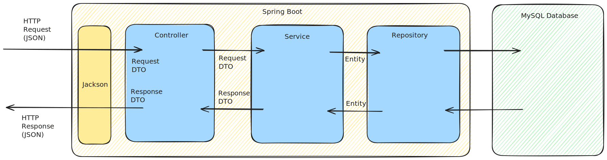

# clouduni
Backend Service For Cloud Software Engineering University

## API
* Add lecturer
  * Endpoint: `/lecturers`
  * JSON Input: `{"name": "John", "surname": "Doe"}`
* Get lecturer by Lecturer Id
  * Endpoint: `/lecturers/{lecturerId}`
  * JSON Output: `{"id":1,"name":"John","surname":"Doe","students":[]}`
* Add student and assign them to an existing lecturer
  * Endpoint: `/students/add/{lecturerId}`
  * JSON Input: `{"name":"Alice","surname":"Smith"}`
* Get student by Student Id
  * Endpoint:  `/students/{studentId}`
  * JSON Output: `{"id":1,"name":"Alice","surname":"Smith","lecturers":[{"id":1,"name":"John","surname":"Doe"}]}`

## Starting and Stopping the Application
In the root project directory run

```docker compose up --build```

This starts a container running the application and another container running the database.  The application is accessible via port `8080`.

The application can be stopped by running

```docker compose down```

## Testing
### Manual Testing
Start the application using ```docker compose up --build```.  The cURL commands below should be entered in another
shell on your machine.

#### Create lecturer
```curl -X POST http://localhost:8080/lecturers -H "Content-Type: application/json" -d '{"name":"John","surname":"Doe"}'```

Expected response:

```
{
  "id": 1,
  "name": "John",
  "surname": "Doe",
  "students": []
}
```
#### Get lecturer by Id
```curl http://localhost:8080/lecturers/1```

Expected response:

```
{
  "id":1,
  "name":"John",
  "surname":"Doe"
  "students":[]
}
```

#### Add student and assign them to an existing lecturer
```curl -X POST http://localhost:8080/students/add/1 -H "Content-Type: application/json" -d '{"name":"Alice" "surname":"Smith"}'```

Expected response:

```
{
  "id": 1,
  "name": "Alice",
  "surname": "Smith",
  "lecturers":[
                {
                  "id": 1,
                  "name": "John",
                  "surname": "Doe"
                }
              ]
}
```

#### Get student by Id
```curl http://localhost:8080/students/1```

Expected response:

```
{
  "id":1,
  "name":"Alice",
  "surname":"Smith",
  "lecturers":[
                {
                  "id":1,
                  "name":"John",
                  "surname":"Doe"
                }
              ]
}
```

### Automated Integration Tests
The automated tests use an in-memory H2 database.  To run them, executing the following from the root project directory

```mvn test```

## Architecture
The code structure is taken from the default project generated by [spring initialzr](https://start.spring.io/)

Data flows through the code as shown in the diagram below.


* **Jackson** A Java library that converts between JSON and Java classes.  It's part of the Spring Boot framework.
* **Controller** Receives HTTP requests, validates inputs, calls the Service, and returns HTTP responses.
* **Service** Implements the business logic.
* **Repository** Communicates with the database.  It allows you to save, retrieve, and delete data without using SQL.
* **DTO** (Data Transfer Object) A Java class used to transfer data between layers.  Necessary to prevent circular dependencies (see below).
* **Entity** A Java class that represents a table in the database.

### Circular Dependencies
The Lecturer contains a list of Students and the Student contains a list of Lecturers.  This introduces a circular dependency that
causes an infinite chain of Lectures to Students to Lecturers to Students, and so on.  In order to break this chain, a Lecturer
contains Students without Lecturers and Students contain Lecturers without Students.  This model is introduced via the DTOs, specifically
the Simple DTOs.

## Resiliency
Resiliency is introduced via **Hikari**, the connection pool used by Spring Boot to manage database connections.  The following options were used:
* **maximum-pool-size: 10** Maximum number of connections to the database (protects the database from load).
* **minimum-idle: 2** Minimum number of open connections (faster response times).
* **connection-timeout: 30000** A request waits for a connection for a maximum of 30 seconds if all 10 connections are busy (prevents app from hanging).
* **idle-timeout: 600000** Unused connections are closed after 10 minutes (frees resources).
* **max-lifetime: 1800000** A connection has a maximum lifetime of 30 minutes (avoids database timeouts).
* **initialization-fail-timeout: 60000** At startup, try connecting to database for 60 seconds (database startup is slower than app startup).

## Validation
Validation of the Lecturer and Student names (no empty names and only alphanumeric characters) is performed when converting
the JSON in the HTTP requests to DTOs.  This is done via the Spring Boot annotations `@NoBlank` and `@Pattern`.

